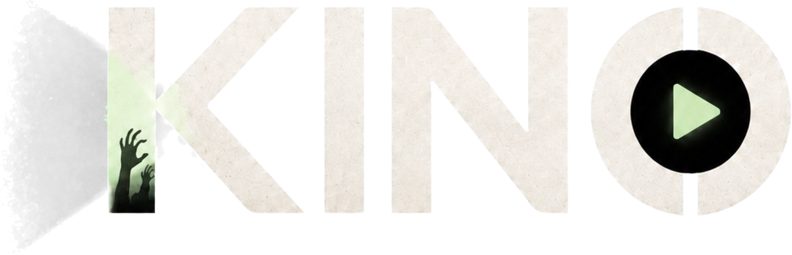

<div align="center">

  
  <br />
  <br />

  [![Contributors][contributors-shield]][contributors-url]
  [![Forks][forks-shield]][forks-url]
  [![Stargazers][stars-shield]][stars-url]
  [![Issues][issues-shield]][issues-url]
  [![License][license-shield]][license-url]

  <p>
    A modern media hub for Android, iOS, and desktop built with Kotlin Multiplatform and Compose Multiplatform.
    <br />
    Stremio addon ecosystem • Cross-platform playback
  </p>

</div>

## About

Kino is an independent rebrand and community fork of [Nuvio Mobile](https://github.com/NuvioMedia/NuvioMobile). It keeps the shared Compose experience for browsing metadata, managing collections, tracking watch progress, downloading content, and using the Stremio addon ecosystem while extending the product with a dedicated desktop shell and Windows installer.

The application is built from a shared Kotlin Multiplatform codebase in [composeApp](./composeApp), with native platform entry points for Android, iOS, and desktop.

## Installation

### Android

Download the latest Android build from the [Kino releases page](https://github.com/115jon/Kino/releases/latest).

### Windows Desktop

Download the latest Windows installer from the [Kino releases page](https://github.com/115jon/Kino/releases/latest).

### iOS

iOS builds are available for local development from the Xcode project in [iosApp](./iosApp).

## Development

```bash
git clone https://github.com/115jon/Kino.git
cd Kino
./scripts/run-mobile.sh android
# or
./scripts/run-mobile.sh ios
```

### Project Structure

- `composeApp/` contains the shared Kotlin Multiplatform and Compose Multiplatform app code.
- `composeApp/src/commonMain/` contains shared UI, features, repositories, and platform-agnostic logic.
- `composeApp/src/androidMain/` contains Android-specific integrations and resources.
- `composeApp/src/desktopMain/` contains desktop-specific integrations and the native window shell.
- `desktop/` contains the Windows installer and packaging scripts.
- `iosApp/` contains the native Xcode project, iOS entry point, and shared version configuration.

Useful commands:

```bash
./gradlew :composeApp:compileKotlinDesktop
./gradlew :composeApp:compileKotlinIosSimulatorArm64
```

For local Windows installer development:

```powershell
./gradlew.bat :composeApp:createReleaseDistributable
powershell -ExecutionPolicy Bypass -File ./desktop/scripts/build-installer.ps1
```

The installer is produced under `desktop/installer/bin/Release/`.

Versioning is driven from `iosApp/Configuration/Version.xcconfig`, which is the shared source of truth for Android and desktop releases.

## Legal & Disclosure

Kino functions solely as a client-side interface for browsing metadata and playing media provided by user-installed extensions and/or user-provided sources. Users are responsible for content they access and for complying with applicable law and third-party service terms.

Kino is not affiliated with, endorsed by, or sponsored by NuvioMedia. It does not host, store, or distribute media content. See [FORK_NOTICE.md](FORK_NOTICE.md) for the complete fork disclosure.

## Built With

- Kotlin Multiplatform
- Compose Multiplatform
- AndroidX Media3
- MPV/libmpv and FFmpeg
- Supabase, TMDB, Trakt, and IntroDB integrations

## Star History

<a href="https://www.star-history.com/#115jon/Kino&type=date&legend=top-left">
 <picture>
   <source media="(prefers-color-scheme: dark)" srcset="https://api.star-history.com/svg?repos=115jon/Kino&type=date&theme=dark&legend=top-left" />
   <source media="(prefers-color-scheme: light)" srcset="https://api.star-history.com/svg?repos=115jon/Kino&type=date&legend=top-left" />
   
 </picture>
</a>

<!-- MARKDOWN LINKS & IMAGES -->
[contributors-shield]: https://img.shields.io/github/contributors/115jon/Kino.svg?style=for-the-badge
[contributors-url]: https://github.com/115jon/Kino/graphs/contributors
[forks-shield]: https://img.shields.io/github/forks/115jon/Kino.svg?style=for-the-badge
[forks-url]: https://github.com/115jon/Kino/network/members
[stars-shield]: https://img.shields.io/github/stars/115jon/Kino.svg?style=for-the-badge
[stars-url]: https://github.com/115jon/Kino/stargazers
[issues-shield]: https://img.shields.io/github/issues/115jon/Kino.svg?style=for-the-badge
[issues-url]: https://github.com/115jon/Kino/issues
[license-shield]: https://img.shields.io/github/license/115jon/Kino.svg?style=for-the-badge
[license-url]: https://github.com/115jon/Kino/blob/main/LICENSE
